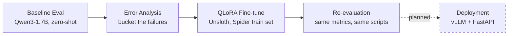

<div align="center">

# Fine-tuning Qwen3-1.7B for Text-to-SQL

**QLoRA fine-tuning on Spider, driven by baseline evaluation and error analysis**


</div>

---

## Why this exists

Most "fine-tune an LLM" projects skip straight to training. This one doesn't:

> **Baseline first → find out *why* it fails → fine-tune to fix that specific weakness → re-measure to confirm it actually worked.**

Every claim below is backed by a script in this repo and a number in `results/` — nothing here is "trust me, it got better."

## Results

Evaluated on the full Spider dev set (1,034 examples) with the official [test-suite-sql-eval](https://github.com/taoyds/test-suite-sql-eval) scorer.

<table>
<tr><th>Metric (all 1,034)</th><th>Baseline</th><th>Fine-tuned</th><th>Δ</th></tr>
<tr><td>Execution Accuracy</td><td align="right">58.7%</td><td align="right"><b>67.3%</b></td><td align="right"><b>+8.6 pts</b></td></tr>
<tr><td>Exact Match</td><td align="right">30.5%</td><td align="right"><b>59.0%</b></td><td align="right"><b>+28.5 pts</b></td></tr>
</table>

**By difficulty** (Execution Accuracy / Exact Match):

| Difficulty | Baseline | Fine-tuned |
|:---|---:|---:|
| easy&nbsp;(n=248) | 81.0% / 64.5% | 87.1% / 82.7% |
| medium&nbsp;(n=446) | 62.6% / 24.7% | 71.7% / 62.8% |
| hard&nbsp;(n=174) | 47.1% / 17.8% | 54.6% / 45.4% |
| extra&nbsp;(n=166) | 27.1% / 8.4% | 39.2% / 27.7% |

### The diagnosis-driven part

Before touching fine-tuning, `src/error_analysis.py` bucketed *why* the baseline failed. The single biggest failure mode: **wrong table/join selection** — joining tables it didn't need, or missing one it did.

| Failure bucket | Baseline | Fine-tuned |
|:---|---:|---:|
| **Wrong table/join set (combined)** | **35.0%** | **23.2%** |
| — hallucinated/extra tables | 21.6% | 13.4% |
| — missing a needed table | 4.3% | 6.9% |
| — missing a needed join | 9.1% | 2.9% |
| Exact string match | 14.2% | 40.2% |

The targeted weakness shrank by ~12 points — evidence the fine-tune fixed the *diagnosed* problem, not just the aggregate metrics. One honest nuance: "missing a needed table" ticked up slightly even as "extra tables" dropped sharply, a modest shift in error mode rather than a clean win across every sub-metric.

## Pipeline



1. **Baseline evaluation** — measure the untouched base model before assuming fine-tuning is even necessary.
2. **Error analysis** — bucket *why* it fails, not just the pass/fail rate.
3. **QLoRA fine-tuning** — via [Unsloth](https://github.com/unslothai/unsloth), reusing the exact same schema/prompt-formatting code from evaluation so training and inference stay consistent.
4. **Re-evaluation** — identical scripts, identical metrics, directly comparable before/after.
5. **Deployment** *(planned, not yet built)* — vLLM behind FastAPI, containerized, benchmarked.

## Training setup

| | |
|:---|:---|
| **Base model** | Qwen3-1.7B (4-bit, via Unsloth) |
| **Method** | QLoRA — rank 16, all attention + MLP projections |
| **Data** | Spider `train_spider.json` + `train_others.json` (8,659 examples) |
| **Hardware** | 1× Colab T4 (free tier) |
| **Schedule** | 3 epochs, effective batch size 8, lr 2e-4, 3,249 steps, ~2h53m |

## Repo structure

```
src/
├─ schema_utils.py         Spider tables.json -> CREATE TABLE schema text
├─ prompts.py               schema-aware prompt building (shared: eval + training)
├─ sql_safety.py            SELECT-only safety gate for generated SQL
├─ generate_predictions.py  generation + latency/throughput/GPU-memory logging
├─ run_eval.py              wraps the official test-suite-sql-eval scorer
├─ error_analysis.py        heuristic failure-bucket classifier
└─ train_qlora.py           Unsloth QLoRA fine-tuning, resumable across Colab disconnects

stage1_baseline_colab.ipynb   baseline evaluation, executed end-to-end on Colab
stage3_finetune_colab.ipynb   fine-tuning + re-evaluation, executed end-to-end on Colab
```

`data/`, `results/`, and `third_party/` are intentionally not committed — datasets and model weights don't belong in git. The notebooks fetch/build them from scratch, and both are checked in **with their real execution output**, not blank templates.

## Reproducing this

Both notebooks run top-to-bottom on Colab (T4 GPU runtime):

1. Upload this repo's contents to a Google Drive folder.
2. Open `stage1_baseline_colab.ipynb` — downloads Spider, clones the eval suite, runs the baseline.
3. Open `stage3_finetune_colab.ipynb` — fine-tunes with QLoRA (checkpoints to Drive every 50 steps, survives a Colab disconnect) and re-runs the same evaluation.

```bash
pip install -r requirements.txt        # evaluation only
pip install -r requirements-train.txt  # + fine-tuning (Unsloth/TRL/bitsandbytes, GPU-only)
```

## Status

- [x] Stage 1 — baseline evaluation
- [x] Error analysis
- [x] Stage 3 — QLoRA fine-tuning + re-evaluation
- [ ] Stage 2 — vLLM + FastAPI deployment, containerization, throughput benchmarking
- [ ] Publish fine-tuned weights to Hugging Face Hub

## Acknowledgments

- [Spider](https://yale-lily.github.io/spider) dataset (Yu et al.)
- [test-suite-sql-eval](https://github.com/taoyds/test-suite-sql-eval) for Execution Accuracy / Exact Match scoring
- [Unsloth](https://github.com/unslothai/unsloth) for QLoRA fine-tuning
